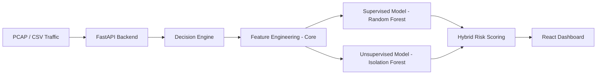

# 📡 Network Traffic Classification & Anomaly Detection

> Adaptive Flow-Level Machine Learning Framework for Supervised Traffic Classification, Unsupervised Anomaly Detection, and Hybrid Decision Intelligence aligned with ITC/NAL operational environments.

---

## 📌 Project Overview

This project implements an end-to-end **network traffic intelligence system** capable of:

- **Flow-level traffic classification** using Random Forest.
- **Zero-day anomaly detection** using Isolation Forest.
- **Hybrid decision-based risk scoring** combining both models.
- **Real-time Visualization** via a React Dashboard and FastAPI Backend.

The framework is modular, reproducible, and designed for operational deployment.

---

# 🏗 System Architecture

## 🔄 High-Level Architecture



---

# 🧠 ML Strategy

## 1️⃣ Supervised Learning (Implemented)
Used for known attack detection and traffic classification.

**Model:** Random Forest Classifier (Robust against noise, high accuracy).

## 2️⃣ Unsupervised Learning (Implemented)
Used for anomaly detection and unknown attack discovery.

**Model:** Isolation Forest (Efficient outlier detection).

## 3️⃣ Hybrid Decision Engine (Implemented)

Combines:
- Supervised probability score
- Unsupervised anomaly score
- Configurable risk thresholds (Critical, High, Medium, Low)

---

# 📂 Repository Structure

```
nal/
│
├── backend/                # FastAPI Application
│   ├── app/
│   │   ├── services/       # Decision Engine & Logic
│   │   └── main.py         # API Endpoints
│
├── frontend/               # React + Vite Dashboard
│   ├── src/
│   │   ├── components/     # Charts & Stats
│   │   └── pages/          # Dashboard & Upload
│
├── core/                   # Shared Modules
│   └── feature_engineering.py  # Preprocessing & Scaling
│
├── training_pipeline/      # ML Training Logic
│   ├── data/               # Raw & Processed Data
│   ├── models/             # Saved Models (.pkl)
│   └── train.py            # Main Training Script
```

---

# ⚙️ Installation & Setup

```bash
# Clone Repository
git clone <repo_url>
cd Network/nal

# Backend Setup
python3 -m venv .venv
source .venv/bin/activate
pip install -r requirements.txt

# Frontend Setup
cd frontend
npm install
```

---

# 🚀 Running the System

## 1. Train the Models
Trains the ML models on data located in `training_pipeline/data/processed/cic_ids/flows`.

```bash
# From 'nal' directory
.venv/bin/python3 training_pipeline/train.py
```

## 2. Start the Backend
Runs the FastAPI server (API & Decision Engine).

```bash
# From 'nal' directory
source .venv/bin/activate
uvicorn backend.app.main:app --host 127.0.0.1 --port 8000 --reload
```

## 3. Start the Frontend
Runs the React Dashboard.

```bash
# From 'nal/frontend' directory
npm run dev
```

---

# 📊 Features

- **Real Data Integration**: Dashboard loads actual training data samples on startup.
- **File Upload**: Support for `.pcap` and `.csv` uploads for real-time analysis.
- **Hybrid Security Scoring**: automatic risk assessment based on ML confidence and anomaly scores.
- **Interactive Dashboard**: Visualizes Traffic Flows, Attack Distribution, and Anomalies.

---

# 🔮 Future Enhancements

- Database Integration (PostgreSQL) for persistent history.
- Real-time packet capture streaming.
- Model Drift Monitoring.
