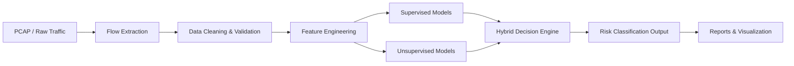
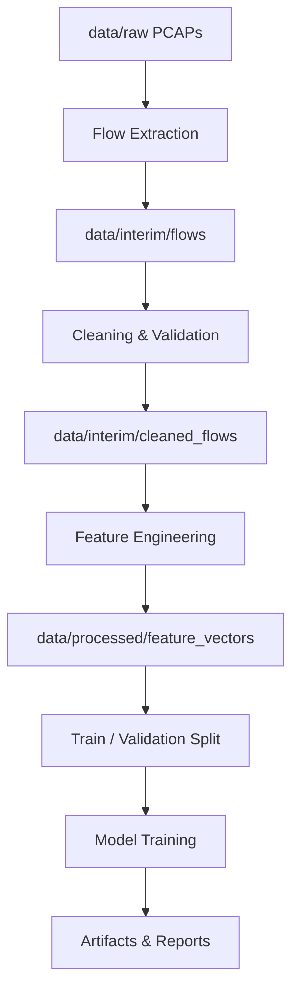

# 📡 Network Traffic Classification & Anomaly Detection

> Adaptive Flow-Level Machine Learning Framework for Supervised Traffic Classification, Unsupervised Anomaly Detection, and Hybrid Decision Intelligence aligned with ITC/NAL operational environments.

---

## 📌 Project Overview

This project implements an end-to-end **network traffic intelligence system** capable of:

- Flow-level traffic classification
- Zero-day anomaly detection
- Hybrid decision-based risk scoring
- Secure dependency tracking (SBOM + Vulnerability Scanning)
- Research-grade experiment tracking

The framework is modular, reproducible, and designed for operational deployment.

---

# 🏗 System Architecture

## 🔄 High-Level Architecture



---

# 🧠 ML Strategy

## 1️⃣ Supervised Learning
Used for known attack detection and traffic classification.

Planned Models:
- Random Forest
- XGBoost
- Logistic Regression
- Deep Neural Networks

---

## 2️⃣ Unsupervised Learning
Used for anomaly detection and unknown attack discovery.

Planned Models:
- Isolation Forest
- One-Class SVM
- Autoencoder
- Local Outlier Factor (LOF)

---

## 3️⃣ Hybrid Decision Engine

Combines:
- Supervised probability score
- Unsupervised anomaly score
- Configurable risk thresholds

Final Output:
- Normal
- Suspicious
- Malicious
- Critical

---

# 📂 Repository Structure

```
Network-Traffic-Classification/
│
├── data/
│   ├── raw/
│   ├── external/
│   ├── interim/
│   └── processed/
│
├── src/
│   ├── data_collection/
│   ├── preprocessing/
│   ├── feature_engineering/
│   ├── models/
│   ├── decision_engine/
│   ├── pipelines/
│   ├── evaluation/
│   └── visualization/
│
├── configs/
├── artifacts/
├── notebooks/
├── results/
├── docs/
└── security/
```

---

# 🔬 Data Pipeline



---

# 🛡 Security (SBOM + Vulnerability Scanning)

This project integrates secure software supply chain practices.

## Generate SBOM

```bash
syft requirements.txt -o cyclonedx-json > security/sbom.json
```

## Scan for Vulnerabilities

```bash
grype sbom:security/sbom.json
```

Ensures:
- Dependency transparency
- CVE detection
- Secure research deployment

---

# ⚙️ Installation

```bash
git clone https://github.com/your-username/network-traffic-classification.git
cd network-traffic-classification

python -m venv .venv
source .venv/bin/activate

pip install -r requirements.txt
```

---

# 🚀 Running Pipelines

Example supervised training:

```bash
python pipelines/train_supervised.py --config configs/supervised.yaml
```

Example anomaly detection:

```bash
python pipelines/train_unsupervised.py --config configs/unsupervised.yaml
```

Hybrid decision engine:

```bash
python pipelines/run_hybrid.py --config configs/hybrid.yaml
```

---

# 📊 Evaluation Metrics

Supervised:
- Accuracy
- Precision
- Recall
- F1-score
- ROC-AUC

Unsupervised:
- ROC-AUC
- PR-AUC
- Anomaly Score Distribution
- Detection Rate

---

# 📈 Results & Reporting

Outputs stored in:

```
results/
├── figures/
├── metrics/
└── reports/
```

Includes:
- Confusion matrices
- ROC curves
- Feature importance plots
- Anomaly score distributions

---

# 📘 Documentation

All documentation stored in:

```
docs/
├── dataset_notes.md
├── experiment_log.md
└── feature_description.md
```

Tracks:
- Dataset provenance
- Feature definitions
- Experiment configurations
- Model comparison logs

---

# 🎯 Project Goals

- Build adaptive ML-driven network defense
- Detect known and unknown threats
- Provide explainable decision logic
- Ensure secure software practices
- Enable reproducible research

---

# 🔮 Future Enhancements

- Real-time streaming classification
- REST API deployment
- Dashboard interface
- Automated CI/CD security scanning
- Model drift monitoring
- Explainable AI (SHAP integration)

---

# 👨‍💻 Author

Network Security Research Project  
ITC / NAL Aligned ML Framework

---

