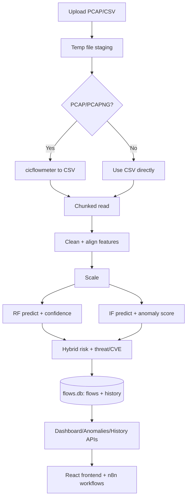

# End-to-End Data Flow

## 1) Passive Upload Pipeline

1. User uploads `.pcap`, `.pcapng`, or `.csv` via `POST /api/upload`.
2. Backend stores upload temporarily in `temp_uploads/`.
3. If packet capture format, `cicflowmeter` converts to CSV.
4. CSV is read in chunks (`chunk_size=50000`).
5. Chunk cleanup and feature alignment happen in decision engine.
6. Scaler/model inference produces labels and anomaly scores.
7. Hybrid scoring and threat/CVE enrichment are attached.
8. Each processed chunk is inserted into SQLite (`monitor_type=passive`).
9. Analysis summary is written into `analysis_history`.
10. Temp upload files are removed.

**Format transitions**
- `multipart/form-data` file -> temporary binary file -> CSV rows -> normalized numeric matrix -> enriched JSON-like flow records -> SQLite rows.

## 2) Active Monitoring Pipeline

1. Operator starts monitor with `POST /api/realtime/start`.
2. Realtime thread captures packets in ~5-second windows (Scapy).
3. Packets are grouped into flows by normalized 5-tuple.
4. 79 CIC-style features are computed per flow.
5. `classify_flows()` applies scaler + RF + IF + rule logic.
6. Enriched flows are inserted into SQLite (`monitor_type=active`).
7. UI/n8n query status and aggregated flow metrics via API.

**Format transitions**
- raw packets -> flow feature dicts -> scaled feature matrix -> enriched flow records -> SQLite rows.

## 3) Query/Visualization Pipeline

1. Frontend requests filtered aggregates and paginated records.
2. `db.py` executes SQL filters and computes distributions/trends.
3. API returns JSON payloads for cards/charts/tables.
4. React pages render time series, severity distributions, and detailed threat tables.

## 4) SBOM Security Pipeline

1. User uploads dependency file to `POST /api/security/sbom/analyze`.
2. Parser extracts package coordinates by ecosystem.
3. CycloneDX structure is generated (if library available).
4. Each package/version is checked against OSV API.
5. Severity and remediation guidance are computed.
6. Result is stored in memory for retrieval and download endpoints.

## Data Flow Diagram

## Real-Time vs Batch

- **Batch:** upload pipeline processes finite files; chunk-based for memory control.
- **Real-time:** polling/capture loop continuously generates active flow records until stopped.
- **Both converge:** same decision logic and same DB schema, enabling unified analytics queries.
